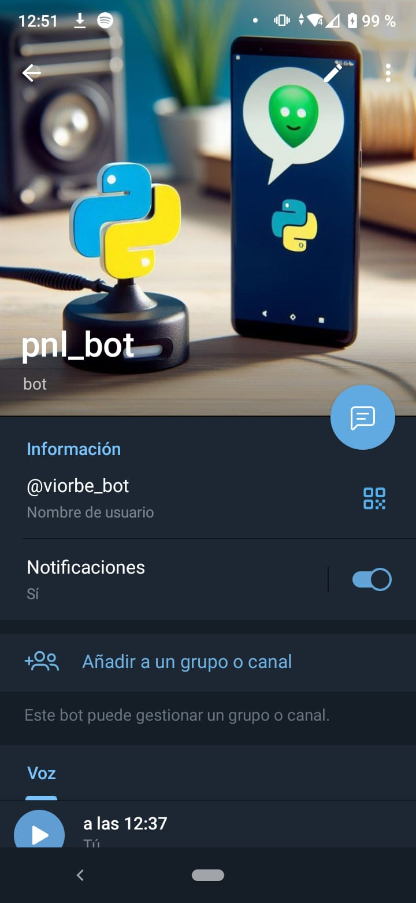

# Speech Recognition con Audios de Telegram

Programa que reconoce audios obtenidos de la plataforma Telegram y los convierte en texto que se imprimirán por pantalla.

(Imagen generada con IA - 21 de enero de 2024. Canva.)

## Contenidos
[1.Introducción](#1-introducción)
[2.Generación del chatbot](#2-generación-del-chatbot)

### 1. Introducción
El objetivo de crear este programa es utilizar la [API de Telegram](https://core.telegram.org) y las bibliotecas de [Python de _speech recognition_](https://pypi.org/project/SpeechRecognition/), para intérpretar audios de Telegram y posteriormente convertirlos en texto. Esta labor podría servir para varias aplicaciones, como por ejemplo:

- Crear un asistente de voz que responda a los mensajes de voz de los usuarios con texto o voz.
- Transcribir conversaciones de Telegram a texto para facilitar su lectura, búsqueda o análisis.
- Desarrollar un bot de Telegram que reconozca comandos de voz y ejecute acciones según lo solicitado.

### 2. Generación del Chatbot
En primer lugar, se ha generado un chatbot en Telegram mediante el uso de la [API de Telegram](https://core.telegram.org). Para lograr esto, se siguieron los pasos proporcionados en el propio chatbot _BotFather_ de la plataforma.

### 3. Programa de descarga de audio (bot_telegram.py)
Fuente: [Documentación de Bots de Telegram de Python](https://docs.python-telegram-bot.org/en/v13.11/index.html)

Este programa de Python utiliza la biblioteca _python-telegram-bot_ para crear un bot de Telegram que puede recibir mensajes de voz. 

A continuación, se presenta un resumen de lo que hace:

- Configuración y Verificación del Token.
- Define una función llamada get_voice que se ejecutará cada vez que el bot reciba un mensaje de voz.
    - Descarga el archivo de voz original desde Telegram.
    - Configura la ruta y descarga el archivo en un directorio llamado 'audios'.
    - Convierte el archivo a formato WAV utilizando la biblioteca pydub.
    - Responde al remitente del mensaje indicando que se ha guardado la nota de voz.
- Configuración del Bot.
- Inicio y Ejecución Continua del Bot.
    - Establece una conexión con los servidores de Telegram y comienza a recibir actualizaciones (polling).
    Pone al bot en un bucle continuo, escuchando y manejando actualizaciones de Telegram.

### 4. Programa de reconocimiento y transcripción de audio (speech_recognition_audios_telegram.py)
Este programa en Python utiliza la biblioteca _SpeechRecognition_ para transcribir un archivo de audio en formato WAV. A continuación, se describen los pasos principales:

- Importa la biblioteca _speech_recognition_.
- Especifica la ruta del archivo de audio en formato WAV.
- Define una función llamada _transcribe_file_ que toma la ruta del archivo de audio como parámetro. Dentro de esta función se intenta reconocer el texto utilizando la API de reconocimiento de voz de Google.
- Muestra por pantalla la transcripción del audio.